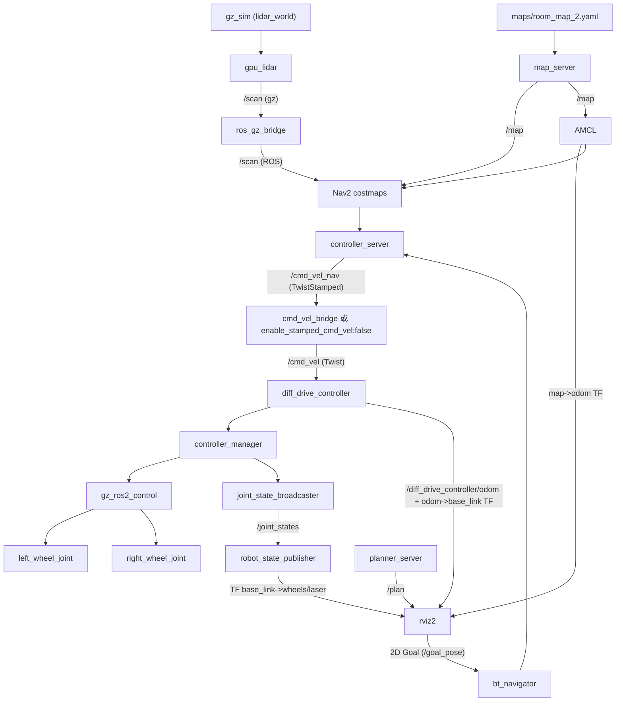

# 概述

本项目是基于 ROS2-Jazzy 和 Gazebo-Sim 实现的 2D 导航小车.

# 功能与特性
- 纯 Gazebo 仿真, 无硬件参与, 后期亦可转移到真实小车上.
- Rviz2 可视化建图, 定位, 导航.
- SLAM 建图, AMCL 定位, Nav2 仿真.
- launch 文件一键启动

# 环境
- Ubuntu 24.02
- ROS2 Jazzy 
- Gazebo Humble 


# 项目构成
```
virtual-mobile-robot
├─ src
│   └─ virtual_robot_base
│   │   └─ src
│   │       └─virtual_diff_drive_node(已弃用)   读取cmd_vel控制小车, 并且发布odom和tf变换
│   ├─ robot_description           
│   │   ├─ launch
│   │   │   └─ display.launch.py(已弃用)        发布小车的形态, 并且启动rviz展示小车
│   │   └─ urdf                                 
│   │       └─ robot.urdf.xacro                 * 小车的形态, gazebo 插件, 
│   ├─ robot_bringup
│   │   └─ launch
│   │       └─virtual_robot_launch(已弃用)      发布小车的形态, 启动驾驶节点(virtual_robot_base包),
│   │                                           启动虚拟雷达, 启动rviz
│   ├─ virtual_robot_sensors
│   │   └─ src
│   │       └─virtual_lidar_node.cpp(已弃用)    虚假的 /scan 发布节点, 用来测试使用
│   └─ robot_gazebo                             主仿真包, 内含多个启动launch
│       ├─ config
│       │   ├─ bridge.yaml                      ROS2 - Gazebo Bridge, Gazebo发布/clock /scan
│       │   ├─ robot_controller.yaml            控制小车的 ROS2 Controller 的配置文件
│       │   └─ nav2_params.yaml                 Nav2 的配置文件
│       ├─ launch
│       │   ├─ navigation.launch.py             启动仿真
│       │   └─ simulation.launch.py             启动 Nav2
│       └─ worlds
│           └─ lidar_world.sdf                  Gazebo 世界文件
│
│
│
└─ maps                                         Slam 建图保存的地图
```

当前项目链路


# 如何运行
1. 安装好必要的库, 详见上述所需环境
2. 在终端中加载好环境 `souce`
3. 运行命令①: `ros2 launch robot_gazebo simulation.launch.py`
4. 运行命令②: `ros2 launch robot_gazebo navigation.launch.py`

- 如果想让小车动起来运行: `ros2 run teleop_twist_keyboard teleop_twist_keyboard --ros-args -p   stamped:=true`

# TODO
- README文档完善
    - 添加依赖包说明
- 添加 SLAM 建图 Launch 文件
- 为rviz添加默认启动配置文件
- 完善 `nav2_params.xmal` 配置文件
- 修改 `cmakelist.txt` 和 `package.xml` 里面的 TODO

# 许可证
本项目基于 [Apache-2.0](https://www.apache.org/licenses/LICENSE-2.0) 发布