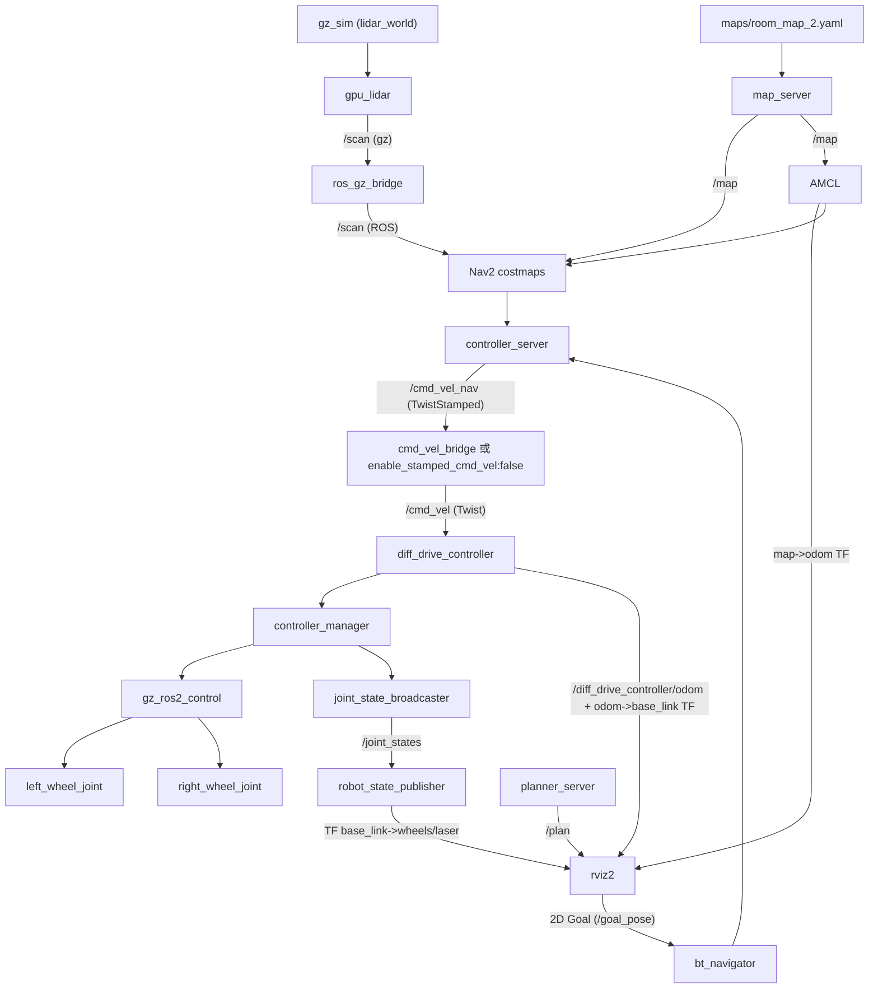

# 1. 概述

本项目是基于 ROS2-Jazzy 和 Gazebo-Sim 实现的 2D 导航小车.

# 2. 功能与特性

- 纯 Gazebo 仿真, 无硬件参与, 后期亦可转移到真实小车上.
- Rviz2 可视化建图, 定位, 导航.
- SLAM 建图, AMCL 定位, Nav2 仿真.
- launch 文件一键启动.

# 3. 环境

- Ubuntu 24.04
- ROS2 Jazzy
- Gazebo Humble

# 4. 项目构成

```
virtual-mobile-robot
├─ src
│   └─ virtual_robot_base
│   │   └─ src
│   │       └─virtual_diff_drive_node(已弃用)   读取cmd_vel控制小车, 并且发布odom和tf变换
│   ├─ robot_description   
│   │   ├─ launch
│   │   │   └─ display.launch.py(已弃用)        发布小车的形态, 并且启动rviz展示小车
│   │   └─ urdf                     
│   │       └─ robot.urdf.xacro                 * 小车的形态, gazebo 插件, 
│   ├─ robot_bringup
│   │   └─ launch
│   │       └─virtual_robot_launch(已弃用)      发布小车的形态, 启动驾驶节点(virtual_robot_base包),
│   │                                           启动虚拟雷达, 启动rviz
│   ├─ virtual_robot_sensors
│   │   └─ src
│   │       └─virtual_lidar_node.cpp(已弃用)    虚假的 /scan 发布节点, 用来测试使用
│   └─ robot_gazebo                             主仿真包, 内含多个启动launch
│       ├─ config
│       │   ├─ bridge.yaml                      ROS2 - Gazebo Bridge, Gazebo发布/clock /scan
│       │   ├─ robot_controller.yaml            控制小车的 ROS2 Controller 的配置文件
│       │   └─ nav2_params.yaml                 Nav2 的配置文件
│       ├─ launch
│       │   ├─ navigation.launch.py             启动仿真
│       │   └─ simulation.launch.py             启动 Nav2
│       └─ worlds
│           └─ lidar_world.sdf                  Gazebo 世界文件
│
│
│
└─ maps                                         Slam 建图保存的地图
```

当前项目链路



# 5. 依赖安装

### （Ubuntu 24.04 / ROS 2 Jazzy）

- 基础环境：ROS 2 Jazzy Desktop（含 rviz2、xacro、robot_state_publisher 等）.
- Gazebo 仿真：`sudo apt install ros-jazzy-ros-gz-sim ros-jazzy-ros-gz-bridge`.
- 控制器：`sudo apt install ros-jazzy-ros2-control ros-jazzy-controller-manager ros-jazzy-diff-drive-controller ros-jazzy-joint-state-broadcaster ros-jazzy-gz-ros2-control`.
- Nav2 导航：`sudo apt install ros-jazzy-navigation2 ros-jazzy-nav2-bringup`.
- SLAM：`sudo apt install ros-jazzy-slam-toolbox`.
- 遥控：`sudo apt install ros-jazzy-teleop-twist-keyboard`.

# 6. 如何运行

## Nav2 导航

1. 安装所需的依赖
2. 在终端中加载环境 `souce /opt/ros/jazzy/setup.bash`, `souce install/setup.bash`.
3. 运行命令①: `ros2 launch robot_gazebo simulation.launch.py`.
4. 确保命令①启动完全后, 运行命令②: `ros2 launch robot_gazebo navigation.launch.py`.

## 键盘操控小车

- 运行 `teleop_twist_keyboard` : `ros2 run teleop_twist_keyboard teleop_twist_keyboard --ros-args -p   stamped:=true`.

## SLAM 建图

- 将新的地图导入 `/robot_gazebo/worlds`, 并且同步修改 `simulation.launch.py` 文件中的 `world_file` 参数.
- 启动 Gazebo 仿真: `ros2 launch robot_gazebo simulation.launch.py`.
- 确保 `navigation.launch.py` 不在运行, 运行SLAM Launch文件: `ros2 launch robot_gazebo slam.launch.py`.
- 新开一个终端运行键盘操控小车程序.
- 保存地图: `ros2 run nav2_map_server map_saver_cli -f ~/virtual-mobile-robot/robot_gazebo/maps/map_name -t /map`.  -t 表示
- *注: 新建地图后需要修改 `navigation.launch.py`文件中 `map_filename`的地图名称变量.*

# 7. Todo

- 继续优化Nav2导航, 解决路径震荡问题.

# 8. 许可证

本项目基于 [Apache-2.0](https://www.apache.org/licenses/LICENSE-2.0) 发布.
